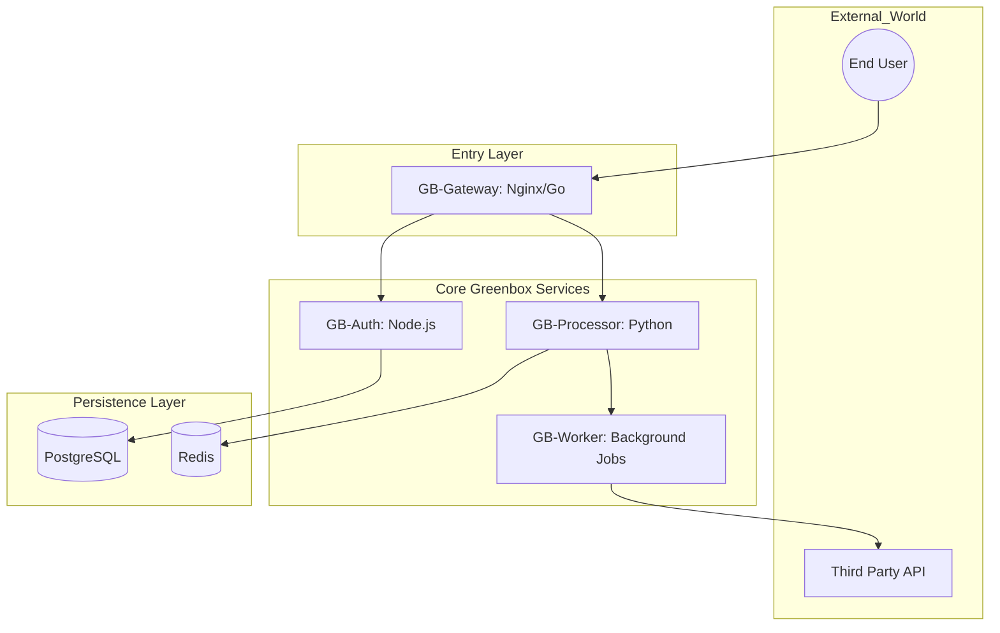
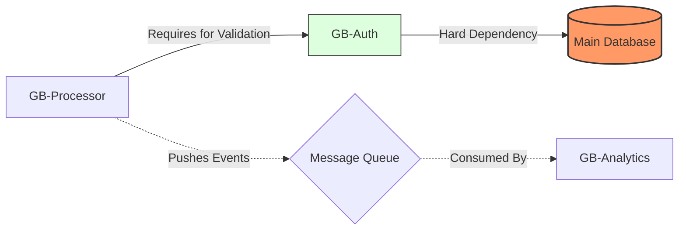

## Application Architecture

```mermaid
graph TD
    subgraph External_World
        User((End User))
        ThirdParty[Third Party API]
    end

    subgraph Entry_Layer[Entry Layer]
        Gateway[GB-Gateway: Nginx/Go]
    end

    subgraph Core_Logic[Core Greenbox Services]
        Auth[GB-Auth: Node.js]
        Proc[GB-Processor: Python]
        Worker[GB-Worker: Background Jobs]
    end

    subgraph Data_Layer[Persistence Layer]
        DB[(PostgreSQL)]
        Cache[(Redis)]
    end

    %% Relationships
    User --> Gateway
    Gateway --> Auth
    Auth --> DB
    Gateway --> Proc
    Proc --> Cache
    Proc --> Worker
    Worker --> ThirdParty
```

---

## Dependency & Deployment Map

```mermaid
graph LR
    %% Definitions
    ServiceA[GB-Processor]
    ServiceB[GB-Auth]
    DB[(Main Database)]
    Queue{Message Queue}

    %% Critical Dependencies (Solid Lines)
    ServiceA -- "Requires for Validation" --> ServiceB
    ServiceB -- "Hard Dependency" --> DB

    %% Async Dependencies (Dotted Lines)
    ServiceA -. "Pushes Events" .-> Queue
    Queue -. "Consumed By" .-> ServiceC[GB-Analytics]

    %% Styling
    style DB fill:#f96,stroke:#333,stroke-width:2px
    style ServiceB fill:#dfd,stroke:#333
```
